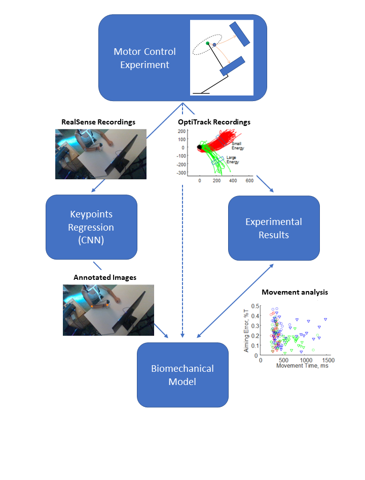

# From-the-Visual-Analysis-of-Movement-to-Principled-Models-of-Motivated-Movement

## Project Description

The first part consisted in designing and carrying out the Motor Control Experiment, to obtain all the experimental data for the subsequent parts of the project. Upon finishing the experimental task, we obtained recordings from a RealSense camera and the Optitrack trajectory tool. 

Using the trajectory results, we collected the experimental results, and performed analysis of the trends showed by our participants. We study the relationships between the different variables of the task and the target metrics of the movement, and try to fit GLMs to show demonstrate these trends.

On the other hand, we use the recordings from the RealSense camera to train a Neural Network that annotates the recorded images, and ultimately returns the trajectories the subjects followed.

Later, we focus on the Development of the Biomechanical model, in order to obtain the characteristic Movement parameters of each subject. For this purpose, we use the annotations given by the Neural Network, which ultimately reflect the original trajectories. We use stochastic minimization techniques to fit the subject's data with the parametric mechanical model that we developed.

Lastly, we evaluate the obtained parameters of our subject, and compare the described behaviour with their experimental results.

